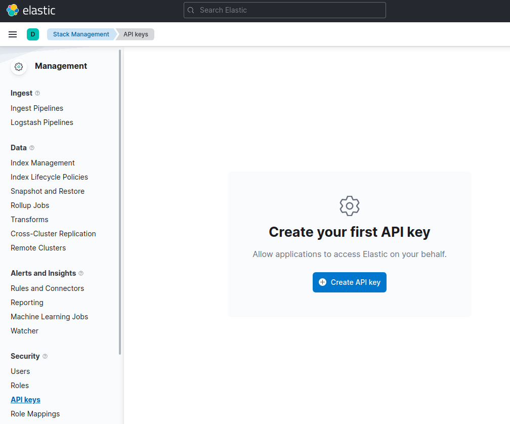

---
mapped_pages:
  - https://www.elastic.co/guide/en/elasticsearch/client/python-api/current/getting-started-python.html
  - https://www.elastic.co/guide/en/serverless/current/elasticsearch-python-client-getting-started.html
---

# Getting started [getting-started-python]

This page guides you through the installation process of the Python client, shows you how to instantiate the client, and how to perform basic Elasticsearch operations with it.


### Requirements [_requirements]

* [Python](https://www.python.org/) 3.10 or newer
* [`pip`](https://pip.pypa.io/en/stable/), installed by default alongside Python


### Installation [_installation]

To install the latest version of the client, run the following command:

::::{tab-set}
:group: sync_or_async

:::{tab-item} Standard Python
:sync: sync
```shell
python -m pip install elasticsearch
```
:::

:::{tab-item} Async Python
:sync: async
```shell
python -m pip install "elasticsearch[async]"
```
:::

::::
Refer to the [*Installation*](/reference/installation.md) page to learn more.


### Connecting [_connecting]

You can connect to the Elastic Cloud using an API key and the Elasticsearch endpoint.

::::{tab-set}
:group: sync_or_async

:::{tab-item} Standard Python
:sync: sync
```py
import os
from elasticsearch import Elasticsearch

client = Elasticsearch(
    "https://...",  # Elasticsearch endpoint
    api_key=os.environ["ELASTIC_API_KEY"],
)
```
:::

:::{tab-item} Async Python
:sync: async
```py
import os
from elasticsearch import AsyncElasticsearch

client = AsyncElasticsearch(
    "https://...",  # Elasticsearch endpoint
    api_key=os.environ["ELASTIC_API_KEY"],
)
```
:::

::::

Your Elasticsearch endpoint can be found on the **My deployment** page of your deployment:


You can generate an API key on the **Management** page under Security.



For other connection options, refer to the [*Connecting*](/reference/connecting.md) section.


### Operations [_operations]

Time to use Elasticsearch! This section walks you through the basic, and most important, operations of Elasticsearch. For more operations and more advanced examples, refer to the [*Examples*](/reference/examples.md) page.


#### Creating an index [_creating_an_index]

This is how you create the `my_index` index:

::::{tab-set}
:group: sync_or_async

:::{tab-item} Standard Python
:sync: sync
```py
client.indices.create(index="my_index")
```
:::

:::{tab-item} Async Python
:sync: async
```py
await client.indices.create(index="my_index")
```
:::

::::

Optionally, you can first define the expected types of your features with a custom mapping.

::::{tab-set}
:group: sync_or_async

:::{tab-item} Standard Python
:sync: sync
```py
mappings = {
    "properties": {
        "foo": {"type": "text"},
        "bar": {
            "type": "text",
            "fields": {
                "keyword": {
                    "type": "keyword",
                    "ignore_above": 256,
                }
            },
        },
    }
}

client.indices.create(index="my_index", mappings=mappings)
```
:::

:::{tab-item} Async Python
:sync: async
```py
mappings = {
    "properties": {
        "foo": {"type": "text"},
        "bar": {
            "type": "text",
            "fields": {
                "keyword": {
                    "type": "keyword",
                    "ignore_above": 256,
                }
            },
        },
    }
}

await client.indices.create(index="my_index", mappings=mappings)
```
:::

::::

#### Indexing documents [_indexing_documents]

This indexes a document with the index API:

::::{tab-set}
:group: sync_or_async

:::{tab-item} Standard Python
:sync: sync
```py
client.index(
    index="my_index",
    id="my_document_id",
    document={
        "foo": "foo",
        "bar": "bar",
    }
)
```
:::

:::{tab-item} Async Python
:sync: async
```py
await client.index(
    index="my_index",
    id="my_document_id",
    document={
        "foo": "foo",
        "bar": "bar",
    }
)
```
:::

::::

You can also index multiple documents at once with the bulk helper function:

::::{tab-set}
:group: sync_or_async

:::{tab-item} Standard Python
:sync: sync
```py
from elasticsearch import helpers

def generate_docs():
    for i in range(10):
        yield {
            "_index": "my_index",
            "foo": f"foo {i}",
            "bar": "bar",
        }

helpers.bulk(client, generate_docs())
```
:::

:::{tab-item} Async Python
:sync: async
```py
from elasticsearch import helpers

async def generate_docs():
    for i in range(10):
        yield {
            "_index": "my_index",
            "foo": f"foo {i}",
            "bar": "bar",
        }

async def bulk_example():
    await helpers.async_bulk(client, generate_docs())
```
:::

::::

These helpers are the recommended way to perform bulk ingestion. While it is also possible to perform bulk ingestion using `client.bulk` directly, the helpers handle retries, ingesting chunk by chunk and more. See the [*Client helpers*](/reference/client-helpers.md) page for more details.


#### Getting documents [_getting_documents]

You can get documents by using the following code:

::::{tab-set}
:group: sync_or_async

:::{tab-item} Standard Python
:sync: sync
```py
client.get(index="my_index", id="my_document_id")
```
:::

:::{tab-item} Async Python
:sync: async
```py
await client.get(index="my_index", id="my_document_id")
```
:::

::::

#### Searching documents [_searching_documents]

This is how you can create a single match query with the Python client:

::::{tab-set}
:group: sync_or_async

:::{tab-item} Standard Python
:sync: sync
```py
client.search(index="my_index", query={
    "match": {
        "foo": "foo"
    }
})
```
:::

:::{tab-item} Async Python
:sync: async
```py
await client.search(index="my_index", query={
    "match": {
        "foo": "foo"
    }
})
```
:::

::::

#### Updating documents [_updating_documents]

This is how you can update a document, for example to add a new field:

::::{tab-set}
:group: sync_or_async

:::{tab-item} Standard Python
:sync: sync
```py
client.update(
    index="my_index",
    id="my_document_id",
    doc={
        "foo": "bar",
        "new_field": "new value",
    }
)
```
:::

:::{tab-item} Async Python
:sync: async
```py
await client.update(
    index="my_index",
    id="my_document_id",
    doc={
        "foo": "bar",
        "new_field": "new value",
    }
)
```
:::

::::

#### Deleting documents [_deleting_documents]

::::{tab-set}
:group: sync_or_async

:::{tab-item} Standard Python
:sync: sync
```py
client.delete(index="my_index", id="my_document_id")
```
:::

:::{tab-item} Async Python
:sync: async
```py
await client.delete(index="my_index", id="my_document_id")
```
:::

::::

#### Deleting an index [_deleting_an_index]

::::{tab-set}
:group: sync_or_async

:::{tab-item} Standard Python
:sync: sync
```py
client.indices.delete(index="my_index")
```
:::

:::{tab-item} Async Python
:sync: async
```py
await client.indices.delete(index="my_index")
```
:::

::::

## Further reading [_further_reading]

* Use [*Client helpers*](/reference/client-helpers.md) for a more comfortable experience with the APIs.
