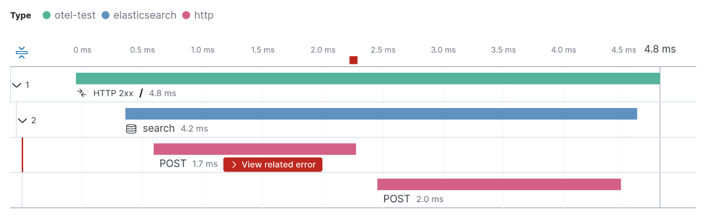

---
mapped_pages:
  - https://www.elastic.co/guide/en/elasticsearch/client/python-api/current/opentelemetry.html
---

# Using OpenTelemetry [opentelemetry]

You can use [OpenTelemetry](https://opentelemetry.io/) to monitor the performance and behavior of your {{es}} requests through the Elasticsearch Python client. The Python client comes with built-in OpenTelemetry instrumentation that emits [distributed tracing spans](docs-content://solutions/observability/apm/traces-ui.md) by default. With that, applications using [manual OpenTelemetry instrumentation](https://www.elastic.co/blog/manual-instrumentation-of-python-applications-opentelemetry) or [automatic OpenTelemetry instrumentation](https://www.elastic.co/blog/auto-instrumentation-of-python-applications-opentelemetry) are enriched with additional spans that contain insightful information about the execution of the {{es}} requests.

The native instrumentation in the Python client follows the [OpenTelemetry Semantic Conventions for {{es}}](https://opentelemetry.io/docs/specs/semconv/database/elasticsearch/). In particular, the instrumentation in the client covers the logical layer of {{es}} requests. A single span per request is created that is processed by the service through the Python client. The following image shows a trace that records the handling of two different {{es}} requests: an `info` request and a `search` request.

% TO DO: Use `:class: screenshot`

Usually, OpenTelemetry auto-instrumentation modules come with instrumentation support for HTTP-level communication. In this case, in addition to the logical {{es}} client requests, spans will be captured for the physical HTTP requests emitted by the client. The following image shows a trace with both, {{es}} spans (in blue) and the corresponding HTTP-level spans (in red) after having installed the ``opentelemetry-instrumentation-urllib3`` package:

% TO DO: Use `:class: screenshot`

Advanced Python client behavior such as nodes round-robin and request retries are revealed through the combination of logical {{es}} spans and the physical HTTP spans. The following example shows a `search` request in a scenario with two nodes:

% TO DO: Use `:class: screenshot`

The first node is unavailable and results in an HTTP error, while the retry to the second node succeeds. Both HTTP requests are subsumed by the logical {{es}} request span (in blue).

### Setup the OpenTelemetry instrumentation [_setup_the_opentelemetry_instrumentation]

When using the [manual Python OpenTelemetry instrumentation](https://opentelemetry.io/docs/languages/python/instrumentation/) or the [OpenTelemetry Python agent](https://opentelemetry.io/docs/languages/python/automatic/), the Python client’s OpenTelemetry instrumentation is enabled by default and uses the global OpenTelemetry SDK with the global tracer provider. If you’re getting started with OpenTelemetry instrumentation, the following blog posts have step-by-step instructions to ingest and explore tracing data with the Elastic stack:

* [Manual instrumentation with OpenTelemetry for Python applications](https://www.elastic.co/blog/manual-instrumentation-of-python-applications-opentelemetry)
* [Automatic instrumentation with OpenTelemetry for Python applications](https://www.elastic.co/blog/auto-instrumentation-of-python-applications-opentelemetry)

## Comparison with community instrumentation [_comparison_with_community_instrumentation]

The [commmunity OpenTelemetry Elasticsearch instrumentation](https://opentelemetry-python-contrib.readthedocs.io/en/latest/instrumentation/elasticsearch/elasticsearch.html) also instruments the client and sends OpenTelemetry traces, but was developed before the OpenTelemetry Semantic Conventions for {{es}}, so the traces attributes are inconsistent with other OpenTelemetry Elasticsearch client instrumentations. To avoid tracing the same requests twice, make sure to use only one instrumentation, either by uninstalling the opentelemetry-instrumentation-elasticsearch Python package or by [disabling the native instrumentation](#opentelemetry-config-enable).

### Configuring the OpenTelemetry instrumentation [_configuring_the_opentelemetry_instrumentation]

You can configure this OpenTelemetry instrumentation through environment variables. The following configuration options are available.

#### Enable / Disable the OpenTelemetry instrumentation [opentelemetry-config-enable]

With this configuration option you can enable (default) or disable the built-in OpenTelemetry instrumentation.

**Default:** `true`

|     |     |
| --- | --- |
| Environment Variable | `OTEL_PYTHON_INSTRUMENTATION_ELASTICSEARCH_ENABLED` |

#### Capture search request bodies [_capture_search_request_bodies]

Per default, the built-in OpenTelemetry instrumentation does not capture request bodies due to data privacy considerations. You can use this option to enable capturing of search queries from the request bodies of {{es}} search requests in case you wish to gather this information regardless. The options are to capture the raw search query or not capture it at all.

**Default:** `omit`

**Valid Options:** `omit`, `raw`

|     |     |
| --- | --- |
| Environment Variable | `OTEL_PYTHON_INSTRUMENTATION_ELASTICSEARCH_CAPTURE_SEARCH_QUERY` |

### Overhead [_overhead]

The OpenTelemetry instrumentation (as any other monitoring approach) may come with a slight overhead on CPU, memory, and latency. The overhead can only occur when the instrumentation is enabled (default) and an OpenTelemetry SDK is active in the target application. When the instrumentation is turned off or no OpenTelemetry SDK is active within the target application, monitoring overhead is not expected when using the client.

Even in cases where the instrumentation is enabled and is actively used (by an OpenTelemetry SDK), the overhead is minimal and negligible in the vast majority of cases. In edge cases where there is a noticeable overhead, the [instrumentation can be explicitly disabled](#opentelemetry-config-enable) to remove any potential impact on performance.
