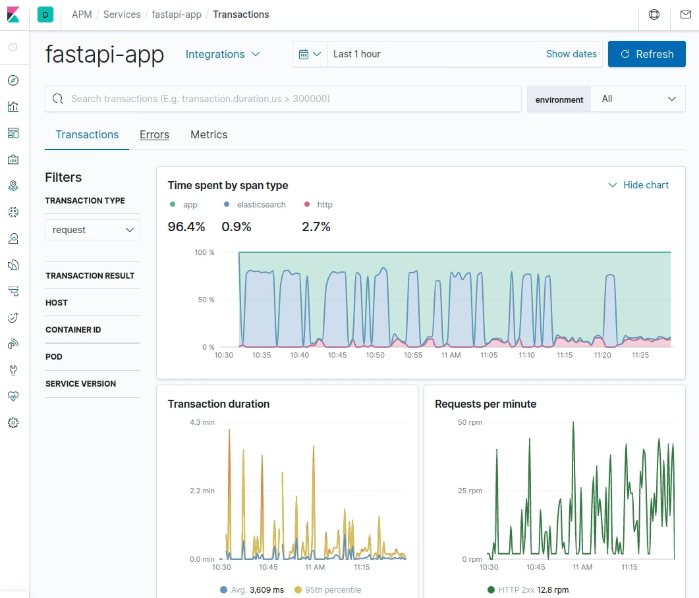

# Async Elasticsearch and Observability Example

This example provides a `docker-compose` file based on
the [Quick start development environment](https://www.elastic.co/guide/en/apm/get-started/current/quick-start-overview.html)
for APM. It gets the default distributions of Elasticsearch,
Kibana and APM Server up and running in Docker.

The docker-compose file also includes a basic [FastAPI](https://fastapi.tiangolo.com/) application using
[`AsyncElasticsearch` to execute requests asychronously](https://elasticsearch-py.readthedocs.io/en/master/async.html)
and a script to ping the web app with different endpoints.

## How to Run

- [Install Docker Compose](https://docs.docker.com/compose/install/)
- Run `docker-compose up` on the root folder of this example (`examples/fastapi-apm/`)
  ```bash
  $ cd examples/fastapi-apm
  $ docker-compose up
  ```
- Follow the steps on the full documentation [at elastic.co](https://www.elastic.co/guide/en/apm/get-started/current/quick-start-overview.html)
  to get APM set up in your Kibana instance.

The following services will be available:

- Kibana:              http://localhost:5601
- Elasticsearch:       http://localhost:9200
- APM Server:          http://localhost:8200
- FastAPI app:         http://localhost:9292

Use your web browser or `curl` against http://localhost:9292/ to check that
everything is working. You should see a JSON response from `cluster.health`.

The docker-compose file will also run a `ping.py` script.
This script will make requests irregularly to the web app to simulate
proper traffic and fill your APM Dashboard with data, even errors.
You can comment the pinger container from `docker-compose.yml` if you want
to have all the services running and test the different endpoints (or add your own)
by yourself.

## Screenshot



## FastAPI App Routes

Once the app is running, you can open the following routes in your web browser or via `curl`. The responses are in JSON:

* `/` - The root path returns the response from `cluster.health`
* `/ingest` - This will bulk insert 1,000 documents in the `games` index in slices of 250 at a time.
* `/search/{param}` - Returns search results for `param`.
* `/error` - This route will trigger an error.
* `/delete` - This route will delete all the data in the `games` index.
* `/delete/{id}` - This route will delete a document with the given id from the `games` index.
* `/update/` - This route will update the `modified` field on some docs in the `games` index.
* `/doc/{id}` - This route will return a document with a given ID from Elasticsearch.

## Data Source

Data is based on a DB dump from February 25, 2020 of [TheGamesDB](https://thegamesdb.net/) game data:  
https://cdn.thegamesdb.net/json/database-latest.json
