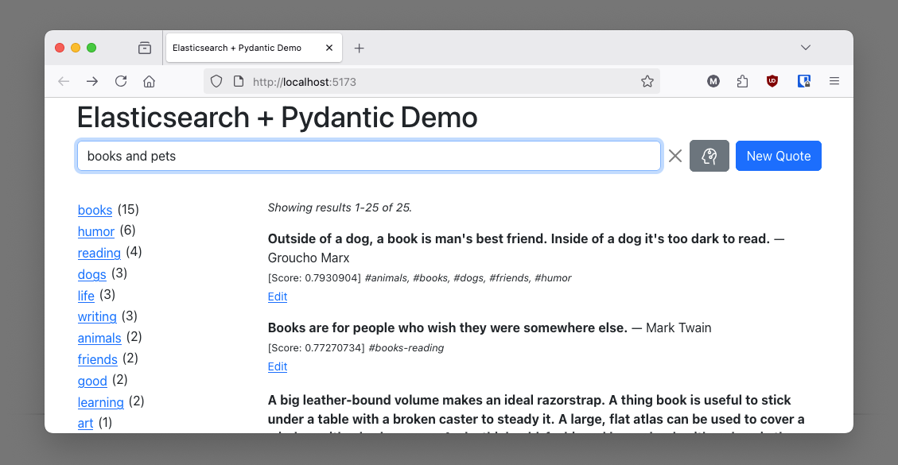

# Quotes
Quotes database example, which demonstrates the Elasticsearch integration with
Pydantic models. This example features a React frontend and a FastAPI back end.



## What is this?

This repository contains a small application that demonstrates how easy it is
to set up a full-text and vector database using [Elasticsearch](https://www.elastic.co/elasticsearch),
while defining the data model with [Pydantic](https://docs.pydantic.dev/latest/).

The application includes a FastAPI back end and a React front end. The example
ingests a dataset of famous quotes into in an Elasticsearch index, and for each quote
it generates an embedding using the
[all-MiniLM-L6-v2](https://huggingface.co/sentence-transformers/all-MiniLM-L6-v2)
Sentence Transformers model.

The dataset used by this application has about 37,000 famous quotes, each with
their author and tags. The data originates from a
[Kaggle dataset](https://www.kaggle.com/datasets/akmittal/quotes-dataset) that
appears to have been generated from quotes that were scraped from the Goodreads
[popular quotes](https://www.goodreads.com/quotes) page.

## Requirements

Please make sure you have the following installed:

- Python 3.10 or newer
- Node.js 18 or newer

## How To Run

Follow these steps to install this demo on your computer:

### Clone this repository

Run the following command to install a copy of this project on your computer:

```bash
git clone https://github.com/elastic/elasticsearch-py
cd examples/quotes
```

### Install the Node and Python dependencies

Run the following command to set up the JavaScript and Python environment and
install all the dependencies:

```bash
npm install
```

### Start a development Elasticsearch container

You can use [start-local](https://www.elastic.co/docs/deploy-manage/deploy/self-managed/local-development-installation-quickstart)
to start a small Elasticsearch instance.

Use this command to launch the instance (Docker and Docker Compose are required):

```bash
curl -fsSL https://elastic.co/start-local | sh
```

### Create the quotes database

Run this command in your terminal:

```bash
npm run ingest
```

This task may take a few minutes. How long it takes depends on your computer
speed and wether you have a GPU, which is used to generate the embeddings if
available.

### Start the back end

Run this command in your terminal:

```bash
npm run backend
```

### Start the front end

Open a second terminal window and run this command:

```bash
npm run dev
```

You can now navigate to `http://localhost:5173` on your web browser to access
the application.
